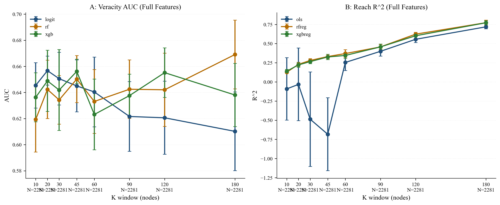
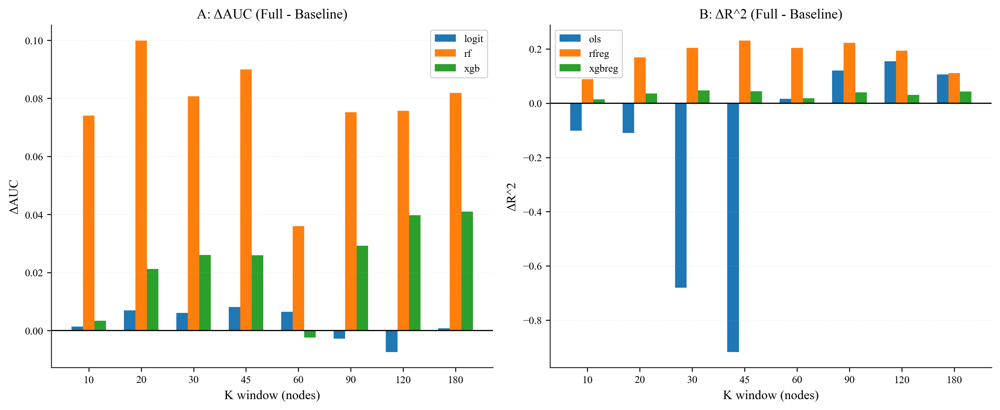
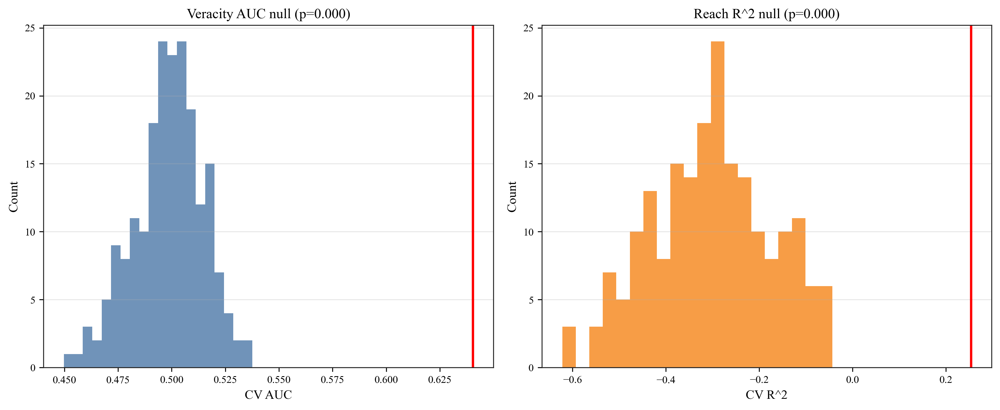

# Early Diffusion Signals for Predicting Reach and Veracity in Social Media Rumor Cascades

## Abstract
This repository evaluates whether early diffusion structure and timing in rumor conversation trees can predict two outcomes: (1) veracity (false vs. non-false) and (2) final cascade reach (log-transformed). The main pipeline uses fixed random seeds, extracts early-window features, residualizes structural features against early volume, adds dynamic and interaction terms, and evaluates multiple model families with cross-validation and permutation tests. The repository is organized for end-to-end reproducibility with a single entry command: `bash reproduce.sh`.

## Main Findings (from current pipeline outputs)
- In size-based windows, veracity peaks at **AUC = 0.657 (k=20)** and reach peaks at **R² = 0.719 (k=180)** (`thesis_outputs/tables/results_k_primary.csv`, `thesis_outputs/figures/F1K_k_veracity_primary.png`, `thesis_outputs/figures/F2K_k_reach_primary.png`).
- Adding structure + dynamics improves peak performance over baseline: veracity **0.650 -> 0.657 AUC**, reach **0.612 -> 0.719 R²** (`thesis_outputs/tables/results_k_primary.csv`, `thesis_outputs/figures/A1K_k_veracity_baseline_full.png`, `thesis_outputs/figures/A2K_k_reach_baseline_full.png`).
- Permutation at `k=60` confirms non-random signal: veracity **0.640 vs 0.499 null mean (AUC)** and reach **0.254 vs -0.302 null mean (R²)** (`thesis_outputs/tables/permutation_test_k60.csv`, `thesis_outputs/figures/F5_permutation_test_signal.png`).
- Model-family comparison shows stronger gains for reach than veracity; best overall is **RF-reg, R² = 0.773 (k=180)** (`thesis_outputs/tables/model_family_comparison_k_full.csv`, `thesis_outputs/figures/F3_model_family_full_only.png`).


## Key Figures
### Figure 1. Veracity classification performance in size-based windows
This plot shows how veracity AUC changes across early size windows and where predictive performance is maximized.


### Figure 2. Reach prediction performance in size-based windows
This plot shows the same window trade-off for reach prediction (R²), highlighting that larger windows improve fit.


### Figure 3. Baseline vs full features for veracity
This comparison isolates the added value of structure and dynamic features beyond the early-volume baseline.


### Figure 4. Baseline vs full features for reach
This figure shows that richer feature sets produce larger and more stable gains for reach prediction.


### Figure 5. Model-family comparison (full feature set)
This figure compares linear and tree-based model classes under the same early-window design.


### Figure 6. Incremental gain decomposition by model
This plot decomposes where gains are concentrated by model family and window, clarifying heterogeneous improvements.


### Figure 7. Permutation-test signal check
Observed scores are contrasted with null distributions, providing a direct robustness check against random-label artifacts.


## Requirements
- Python tested: **3.12.2**
- Install dependencies:
```bash
pip install -r requirements.txt
```

`xgboost` is optional. The pipeline is designed to run without it (fallback models are used automatically).

## Data Setup
See `Data/README.md` for exact required folders/files.

Default expected dataset location:
- `Data/rumor_detection_acl2017/twitter15/...`
- `Data/rumor_detection_acl2017/twitter16/...`

## Reproduce (clean machine)
```bash
git clone https://github.com/JiahaoZhang2001/thesis-data.git
cd thesis-data
python3 -m venv .venv
source .venv/bin/activate
pip install -r requirements.txt
bash reproduce.sh
```

This writes outputs to:
- `thesis_outputs/tables/`
- `thesis_outputs/figures/`
- `thesis_outputs/logs/`
- `thesis_outputs/captions/`
All reported tables and figures can be regenerated by running `bash reproduce.sh`.

## Repository Layout
```text
.
├── CITATION.cff
├── README.md
├── requirements.txt
├── reproduce.sh
├── main.py
├── Data/
│   ├── README.md
│   └── rumor_detection_acl2017/
└── thesis_outputs/            # generated results (tables/figures/logs/captions)
```

## Citation
Please cite this project using metadata in `CITATION.cff`.
