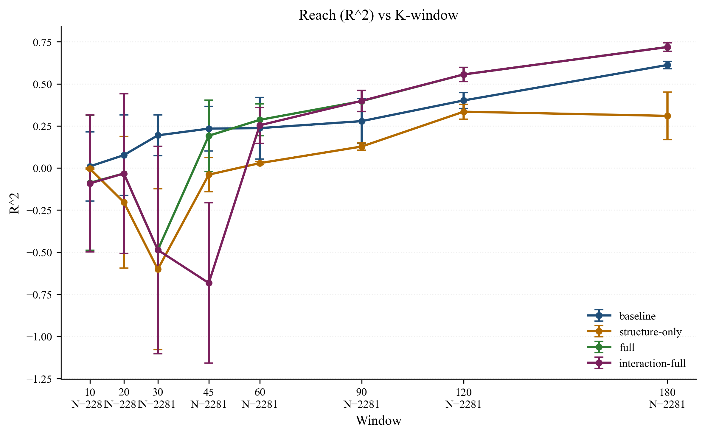

# Early Diffusion Signals for Predicting Reach and Veracity in Social Media Rumor Cascades

## Abstract
This repository evaluates whether early diffusion structure and timing in rumor conversation trees can predict two outcomes: (1) veracity (false vs. non-false) and (2) final cascade reach (log-transformed). The main pipeline uses fixed random seeds, extracts early-window features, residualizes structural features against early volume, adds dynamic and interaction terms, and evaluates multiple model families with cross-validation and permutation tests. The repository is organized for end-to-end reproducibility with a single entry command: `bash reproduce.sh`.

## Main Findings (from current pipeline outputs)
- Veracity AUC is consistently above chance in size-based windows; primary peak is around **AUC ~0.657 at k=20**.
- Reach prediction benefits more from richer nonlinear structure/dynamic features than veracity does, especially in larger windows.
- Permutation test at `k=60` shows strong signal:
  - Veracity: observed AUC **0.640** vs null mean **0.499** (`thesis_outputs/tables/permutation_test_k60.csv`)
  - Reach: observed R² **0.254** vs null mean **-0.302** (`thesis_outputs/tables/permutation_test_k60.csv`)
- Key output files:
  - `thesis_outputs/tables/results_k_primary.csv`
  - `thesis_outputs/tables/k_primary_paired_ttests.csv`
  - `thesis_outputs/figures/F1K_k_veracity_primary.png`
  - `thesis_outputs/figures/F2K_k_reach_primary.png`
  - `thesis_outputs/logs/run_config.json`


## Key Figures
### Figure 1. Veracity classification performance in size-based windows


### Figure 2. Reach prediction performance in size-based windows


## Requirements
- Python tested: **3.12.2**
- Install dependencies:
```bash
pip install -r requirements.txt
```

`xgboost` is optional. The pipeline is designed to run without it (fallback models are used automatically).

## Data Setup
See `Data/README.md` for exact required folders/files.

Default expected dataset location:
- `Data/rumor_detection_acl2017/twitter15/...`
- `Data/rumor_detection_acl2017/twitter16/...`

## Reproduce (clean machine)
```bash
git clone https://github.com/JiahaoZhang2001/thesis-data.git
cd thesis-data
python3 -m venv .venv
source .venv/bin/activate
pip install -r requirements.txt
bash reproduce.sh
```

This writes outputs to:
- `thesis_outputs/tables/`
- `thesis_outputs/figures/`
- `thesis_outputs/logs/`
- `thesis_outputs/captions/`

## Repository Layout
```text
.
├── CITATION.cff
├── README.md
├── requirements.txt
├── reproduce.sh
├── main.py
├── Data/
│   ├── README.md
│   └── rumor_detection_acl2017/
└── thesis_outputs/            # generated results (tables/figures/logs/captions)
```

## Citation
Please cite this project using metadata in `CITATION.cff`.
